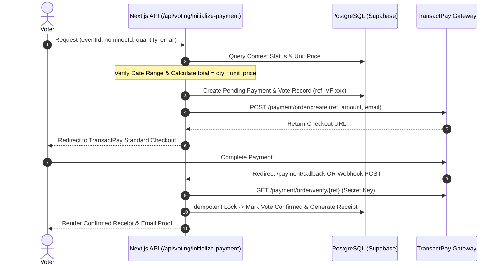

# JVican Vote Arena — Production-Ready Multi-Contest & Paid Voting Platform

JVican Vote Arena is a complete, scalable, and responsive multi-contest voting and paid-voting platform built with **Next.js 16 (App Router)**, **TypeScript**, **Tailwind CSS**, **Supabase (PostgreSQL with RLS & Storage)**, and **TransactPay** payment gateway with transactional email receipts.

---

## 🌟 Key Architecture & Highlights

1. **Zero Voter Friction**: Voters never need an account. They simply choose a vote package, supply an email for their verified receipt, and checkout securely.
2. **Authoritative Server Pricing**: All calculations (`quantity * unit_price = total_amount`) and event active date checks are strictly performed server-side.
3. **Idempotent Payment Webhooks**: Prevents duplicate confirmation, double-counting votes, or multiple receipt dispatches on gateway retries or network interruptions.
4. **Certified Receipt Verification**: Public cryptographic verification at `/receipt/[publicId]` without leaking sensitive database IDs.
5. **Full Organizer Studio**: Manage contests, categories, contestants, live standings toggle, real-time audit ledger, and CSV export.
6. **Dynamic Seed Contests**:
   - Miss Igbeti 2026
   - Mr Igbeti 2026
   - MC Icon Igbeti 2026
   - Best Teacher Igbeti 2026
   - Best Photographer Igbeti 2026

---

## 🚀 Getting Started

### 1. Installation

```bash
cd scratch/voteflow
npm install
```

### 2. Environment Variables

Copy `.env.example` to `.env.local`:

```env
NEXT_PUBLIC_SUPABASE_URL=https://your-project.supabase.co
NEXT_PUBLIC_SUPABASE_ANON_KEY=your_anon_key
SUPABASE_SERVICE_ROLE_KEY=your_service_role_key

TRANSACTPAY_API_URL=https://payment-api-service.transactpay.ai
TRANSACTPAY_PUBLIC_KEY=tp_pub_your_key
TRANSACTPAY_SECRET_KEY=tp_sec_your_key
TRANSACTPAY_WEBHOOK_SECRET=tp_whsec_your_key

RESEND_API_KEY=re_your_resend_key
EMAIL_FROM="JVican Vote Arena Receipts <receipts@votearena.jvican.com>"
NEXT_PUBLIC_APP_URL=http://localhost:3000
```

### 3. Database Migration

Run `src/supabase/schema.sql` and `src/supabase/seed.sql` in your Supabase SQL editor to create all tables with Row Level Security (RLS) policies and seed data.

### 4. Run Development Server

```bash
npm run dev
```

Open [http://localhost:3000](http://localhost:3000) in your browser.

---

## 🗺️ Route Sitemap

### Public
- `/` — Homepage (Hero, Featured Igbeti Contests, How it Works, Winners Preview, Organizer CTA)
- `/contests` — Discovery catalog with All | Live | Upcoming | Closed tabs
- `/contest/[slug]` — Contest page with Overview, Contestants, Categories, Leaderboard, Results
- `/contestants` — Global contestant discovery & search
- `/contestant/[id]` — Dedicated candidate profile with quick vote packages and 1-click sharing
- `/winners` — Hall of Fame of concluded contests & certified champions
- `/how-it-works` — Dual-track guide for voters and contest organizers
- `/about` — Platform philosophy and transparency architecture
- `/receipt/[id]` — Public cryptographic receipt verification
- `/payment/callback` — Post-payment return handler & verification celebration
- `/payment/simulate-checkout` — TransactPay sandbox simulation checkout

### Organizer
- `/login` — Organizer portal login
- `/create-contest` — Contest creation wizard
- `/dashboard` — Organizer metrics, active contests, and recent transactions
- `/dashboard/events/[id]` — Contest studio (Categories, Contestants, Live Ledger, CSV Export)

---

## 🛡️ Authoritative Payment Security Flow


